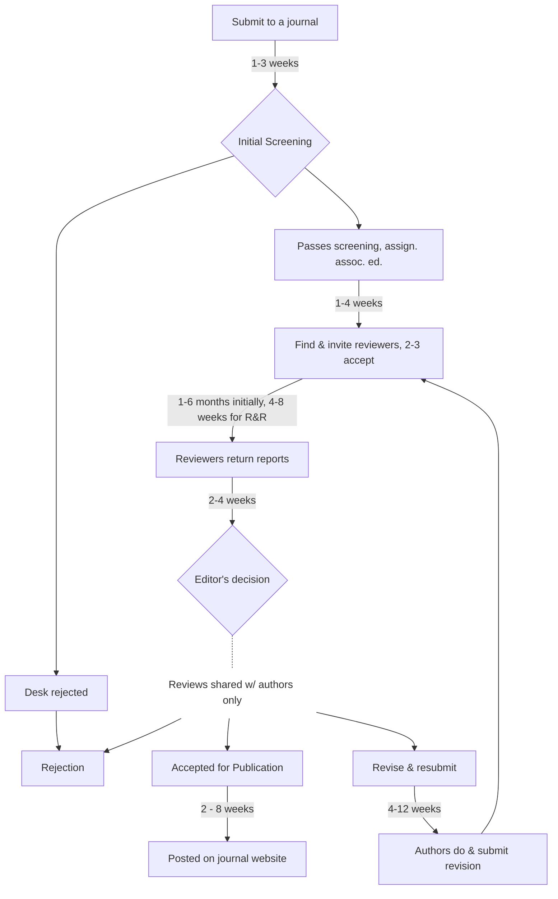

# Reshaping academic evaluation: Beyond accept/reject

[_See also..._](#user-content-fn-1)[^1]

## Rate and give feedback, don’t accept/reject

**Claim:** _Rating and feedback is better than an ‘all-or-nothing’ accept/reject process. Although people like to say “peer review is not binary”, the consequences are._

“Publication in a top journal” is used as a signal and a measuring tool for two major purposes. First, policymakers, journalists, and other researchers look at _where a paper is published_ to assess whether the research is credible and reputable. Second, universities and other institutions use these _publication outcomes_ to guide hiring, tenure, promotion, grants, and other ‘rewards for researchers.’


**Did you know?:** More often than not, [academic economists speak](https://twitter.com/search?q=%22Yes%20I%20always%20found%20it%20bizarre%20that%20we%20talk%20about%20the%20%E2%80%9Csupply%E2%80%9D%20of%20spots%20in%20coveted%20journals%20vs%20the%20%E2%80%9Cdemand%E2%80%9D%20for%20publishing%20there%22\&src=typed\_query) of the "supply of spaces in journals” and the “demand to publish in these journals”. Who is the consumer? Certainly not the perhaps-mythical creature known as the ‘reader’.


<strong>But don't we need REJECTION as a hard filter to weed out flawed and messy content?</strong>

Perhaps not. We are accustomed to using ratings as filters in our daily lives. Readers, grantmakers, and policymakers can set their own threshold. They could disregard papers and projects that fail to meet, for instance, a standard of at least two peer reviews, an average accuracy rating above 3, and an average impact rating exceeding 4.

### Pursuing 'top publications' can be very time-consuming and risky for career academics

In the field of economics, [it is not unusual for it to take years ](https://www.nber.org/papers/w29147)between the ‘first working paper’ that is publicly circulated and the final publication. During that time, the paper may be substantially improved, but it may not be known to nor accepted by practitioners. Meanwhile, it provides little or no career value to the authors.

As a result, we see three major downsides:

1. **Time spent gaming the system:**

Researchers and academics spend a tremendous amount of time 'gaming' this process, at the expense of actually _doing_ [better research](#user-content-fn-2)[^2].

2. **Randomness in outcomes, unnecessary uncertainty and stress**
3. **Wasted feedback, including reviewer's time**

### **Time spent gaming the system**

I (Reinstein) have been in academia for about 20 years. Around the departmental coffee pot  and during research conference luncheons, you might expect us to talk about theories, methods, and results. But roughly half of what we talk about is “who got into which journal and how unfair it is”; “which journal should we be submitting our papers to?”; how long are their “turnaround times?”; “how highly rated are these journals?”; and so on. We even exchange [tips](https://twitter.com/search?q=%22%20how%20to%20strategically%20please%20referees%20and%20sneak%20it%20into%20journals%22\&src=typed\_query) on how to [‘sneak into these journals’.](https://twitter.com/GivingTools/status/1188786422381268992)

There is a lot of pressure, and even bullying, to achieve these “publication outcomes” at the expense of careful methodology.

### **Randomness in outcomes**

The current system can sideline deserving work due to unpredictable outcomes. There's no guarantee that the cream will rise to the top, making research careers much more stressful—even driving out more risk-averse researchers—and sometimes encouraging approaches that are detrimental to good science.

### **Wasted feedback**

A lot of ‘feedback’ is wasted, including the [reviewers' time](https://www.aje.com/arc/peer-review-process-15-million-hours-lost-time/).  Some reviewers write ten-page reports critiquing the paper in great detail[^3], even when they reject the paper. These reports are sometimes very informative and useful for the author and would also be very helpful for the wider public and research community to understand the nature of the debate and issues.

However, researchers often have a very narrow focus on getting the paper published as quickly and in as high-prestige a journal as possible. Unless the review is part of a 'Revise and Resubmit' that the author wants to fulfill, they may not actually put the comments into practice or address them in any way.

Of course, the reviews may be misinformed, mistaken, or may misunderstand aspects of the research. However, if the paper is rejected (even if the reviewer was positive about the paper), the author has no opportunity or incentive to respond to the reviewer. Thus the misinformed reviewer may remain in the dark.

_The other side of the coin_: a lot of effort is spent trying to curry favor with reviewers who are often seen as overly fussy and not always in the direction of good science.

<strong>Some examples (quotes)</strong>: 

John List (Twitter [5 July 2023)](https://twitter.com/GivingTools/status/1676663162349789185): "We are resubmitting a revision of our study to a journal and the letter to the editor and reporters is 101 pages, single-spaced. Does it have to be this way?"

Paola Masuzzo; “I was told that publishing in Nature/Cell/Science was more important than everything else.”

Anonymous; "This game takes away the creativity, the risk, the ‘right to fail’. This last item is for me, personally, very important and often underestimated. Science is mostly messy. Whoever tells us otherwise, is not talking about Science.”

## The standard mode at top economics journals

[Here's a rough sketch](#user-content-fn-4)[^4] of the process and timings at top journals in economics. [Hadevand et al](https://pubs.aeaweb.org/doi/pdfplus/10.1257/jel.20221653) report an average of _over 24 months_ between initial submisison and final acceptance (and nearly three years until publication).

[^1]: * [Link](https://docs.google.com/document/d/1GFISlF5TieCuA6jDYkYlNWaEpuEYrr\_zTmaVpTfBg4A/edit#heading=h.e1wqoks5tivx) to earlier discussion space

    <!---->

    * Slide collage of 'academics complaining' [beginning here](https://docs.google.com/presentation/d/194u2NNvFSvc3IOfQwIrF5d4W3eFyW9GXrw\_igWQOS3g/edit#slide=id.g15b6b3080d0\_0\_521)

[^2]: ... or communicating their work, or teaching, or other productive activities,

[^3]: Possibly to impress editors, or because they simply feel compelled to do so

[^4]: These are informed guesses inferring from reports from papers like [Hadevand et al](https://pubs.aeaweb.org/doi/pdfplus/10.1257/jel.20221653)
