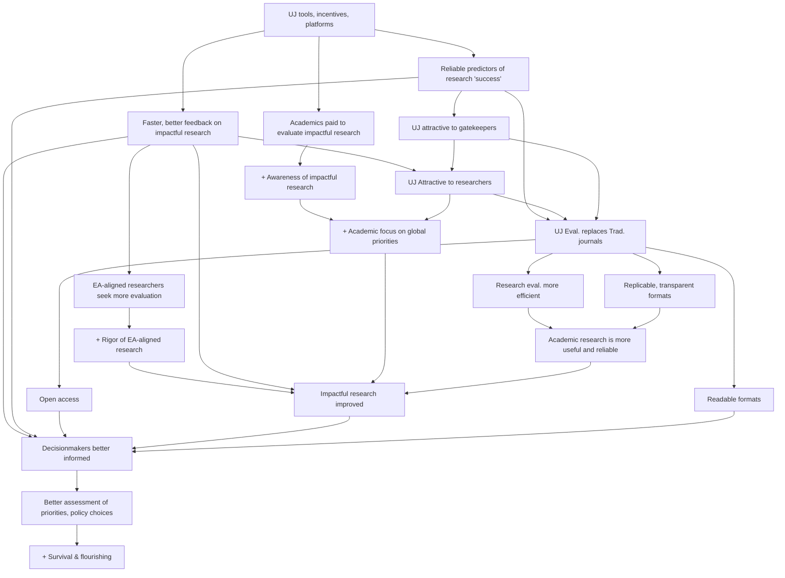

# Global priorities: Theory of Change

See also [acx-ltff-grant-proposal-as-submitted-successfull](../grants-and-proposals/acx-ltff-grant-proposal-as-submitted-successfull/ "mention")

All of our ToC paths (shown above) begin with our setting up, funding, communicating, and incentivizing participation in a strong, open, efficient research evaluation system. These all and lead to impactful research being more in-depth, more reliable, more accessible, and more useful, better informing decisionmakers, and leading to better decisions and outcomes.   \

Highlighting some of the key paths:

1. Faster and better feedback on impactful research will better inform policymakers and philanthropists.
2. The Unjournal’s more efficient, open, and flexible processes will become attractive to academics and stakeholders. As we become better at ‘predicting publication outcomes’, we will become a replacement for traditional processes,  improving research overall (some of which will be highly impactful research).&#x20;

* This process will also nudge mainstream academics towards focusing on impact and global priorities, and towards making their research and outputs more accessible and useable.&#x20;

3\. Our processes and incentives will foster ties between mainstream/prominent/academic/policy researchers and global-priorities/EA-focused researchers. This will improve the rigor, credibility, exposure, and influence of previously ‘EA niche’ work, while helping mainstream researchers better understand and incorporate ideas, principles and methods from the EA and rationalist research communities (counterfactual impact, cause-neutrality, reasoning transparency, etc.)&#x20;

## Detailed explanations of key paths

### _Rapid, informative, transparent feedback and evaluation to inform policymakers and researchers_

Rigorous quantitative and empirical research in economics, business, public policy, and social science has the potential to improve our decision-making and enable a flourishing future. This can be seen in the research frameworks proposed by 80,000 hours, Open Philanthropy, and The Global Priorities Institute (see [what-is-ea-gp-relevant-research.md](../the-field-and-ea-gp-research/what-is-ea-gp-relevant-research.md "mention")). This research is routinely used by effective altruists working on global priorities or existential risk mitigation. It informs both philanthropic decisions (e.g., those influenced by [GiveWell's Cost-Effectiveness Analyses](https://www.givewell.org/how-we-work/our-criteria/cost-effectiveness/cost-effectiveness-models), whose inputs are largely based on academic research) and [national public policy](https://academic.oup.com/ser/article/12/4/779/1653602)\
\
However, the academic publication process is notoriously slow; for example, in economics it [routinely takes 2-6 years](https://www.nber.org/papers/w29147) between the first presentation of a research paper and the eventual publication in a peer-reviewed journal. Recent reforms have sped up parts of the process  by encouraging researchers to put working papers/preprints online. &#x20;

\
However, working papers and preprints often receive at most only a cursory check before publication, and it is up to the reader to judge quality for themselves.  Decision-makers and other researchers rely on peer review to judge the work’s credibility. This part remains slow and inefficient. Furthermore, it provides very noisy signals: a paper is typically judged by the ‘prestige of the journal it lands in’ (perhaps after an intricate odyssey across journals), but it is hard to know why it ended up there. Publication success is seen to depend on personal connections, cleverness, strategic submission strategies, good presentation skills, and relevance to the discipline’s methods and theory. These factors are largely irrelevant to whether and how philanthropists and policymakers should consider and act on a paper’s claimed findings.  Reviews are kept secret; the public never learns why a paper was deemed worthy of a journal, nor what its strengths and weaknesses were. &#x20;

We believe that disseminating research sooner  – along with measures of its credibility– is better.&#x20;

We also believe that publicly evaluating its quality before (and in addition to) journal publication will add substantial additional value, providing:&#x20;

1. A quality assessment (by experts in the field) that can be read alongside the preprint by decision makers or other researchers, helping these users weigh its strengths and weaknesses, and interpreting its implications.
2. Faster feedback to authors, focused on improving the rigor and impact of the work.&#x20;

Various initiatives in the life sciences are already begun reviewing preprints. While economics took the lead in sharing working papers, public evaluation of economics, business,  and social science research is rare. The Unjournal is the first initiative to publicly evaluate rapidly-disseminated work from these fields. Our specific priority: research relevant to global priorities

So, how does this contribute to better 'survival and flourishing' outcomes?

The Unjournal will encourage and incentivize substantive and helpful feedback and careful quantitative evaluation. We will publish these evaluations in a carefully curated space, and clearly aggregate and communicate this output.\

This will help us achieve our focal,  most tangible ‘theory of change’ pathway (mapped in our ‘Plan for Impact’.)&#x20;

* better (faster, public, more thorough, more efficient, quantified, and impact-minded) evaluation of pivotal research&#x20;
* makes this research better  (both the evaluated work and adjacent work), encourages more such work
* and makes it easier for decision-makers to evaluate and use it, leading to better decisions and better outcomes,
* reducing X-risk and contributing to long-term survival and flourishing.

### Faster, better feedback, attractiveness to researchers and gatekeepers, improved research formats, better and more useful research

The Unjournal’s open feedback should also be valuable to the researchers themselves and their research community, catalyzing progress. As the Unjournal Evaluation becomes a valuable outcome in itself, researchers can spend less time ‘gaming the journal system’. Shared public evaluation will provide an important window to other researchers, helping them better understand the relevant cutting-edge concerns. The Unjournal will permit research to be submitted in a wider variety of useful formats (e.g., dynamic documents and notebooks rather than ‘frozen pdfs’), enabling more useful, replicable content and less time spent formatting papers for particular journals. We will also allow researchers to improve their work ‘in situ’ and gain updated evaluations, rather than having to spin-off new papers. This will make the literature more clear and less cluttered.

\

\

\
