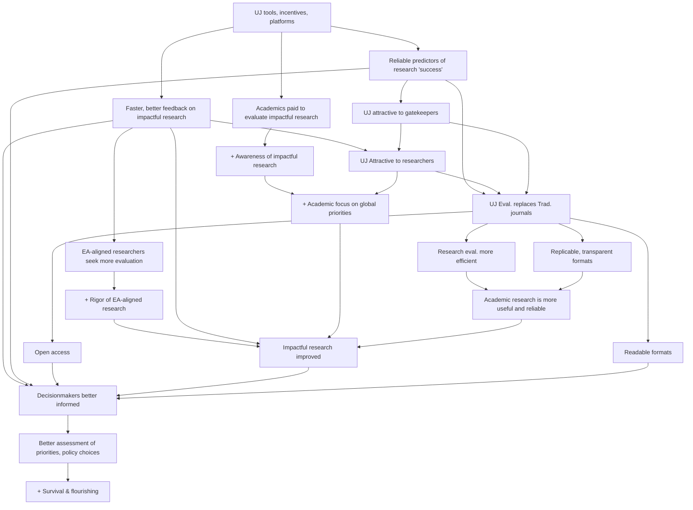

# Global priorities: Theory of Change

See also [acx-ltff-grant-proposal-as-submitted-successfull](../grants-and-proposals/acx-ltff-grant-proposal-as-submitted-successfull/ "mention")

```mermaid
flowchart TD
A0[UJ tools, incentives, platforms] -->  A[Faster/better feedback on impactful research ] 
A[Faster/better feedback on impactful research ] --> EAR[EA-aligned researchers seek more evaluation] --> EAR1[+ Rigor of EA-aligned research] --> A1[Impactful research improved]
A0[UJ tools, incentives, platforms] --> I[Academics paid to evaluate impactful research] --> I2[+ Awareness of impactful research] --> D1[+ Academic focus on global priorities] 
 A[Faster/better feedback on impactful research ]  --> D[UJ Attractive to researchers]
 A[Faster/better feedback on impactful research ] --> A1[Impactful research improved] 
    A[Faster, better feedback on impactful research ] --> A2[Decisionmakers better informed]
A0[UJ tools, incentives, platforms] --> B[Reliable predictors of research 'success'] --> B2[Replaces traditional journals] 
B[Reliable predictors of research 'success'] --> A2[Decisionmakers better informed]
D[UJ Attractive to researchers] --> B2[UJ Eval. replaces Trad. journals] 
B1[UJ attractive to gatekeepers] --> D[UJ Attractive to researchers]
 D[UJ Attractive to researchers] --> D1[+ Academic focus on global priorities] --> A1[Impactful research improved]
B[Reliable predictors of research 'success'] --> B1[UJ attractive to gatekeepers] --> B2[UJ Eval. replaces Trad. journals] 
B2[UJ Eval. replaces Trad. journals] --> B3[Research eval. more efficient] --> B35[Academic research is more useful and reliable] --> A1[Impactful research improved]
B2[UJ Eval. replaces Trad. journals] --> B4[Open access] --> A2[Decisionmakers better informed]
A1[Impactful research improved] --> A2[Decisionmakers better informed]
B2[UJ Eval. replaces Trad. journals] --> B5[Readable formats ] --> A2[Decisionmakers better informed] --> E1[Better assessment of priorities, policy choices] --> O[+ Survival & flourishing]
B2[UJ Eval. replaces Trad. journals]--> B6[Replicable, transparent formats] --> B35[Academic research is more useful and reliable]
```

