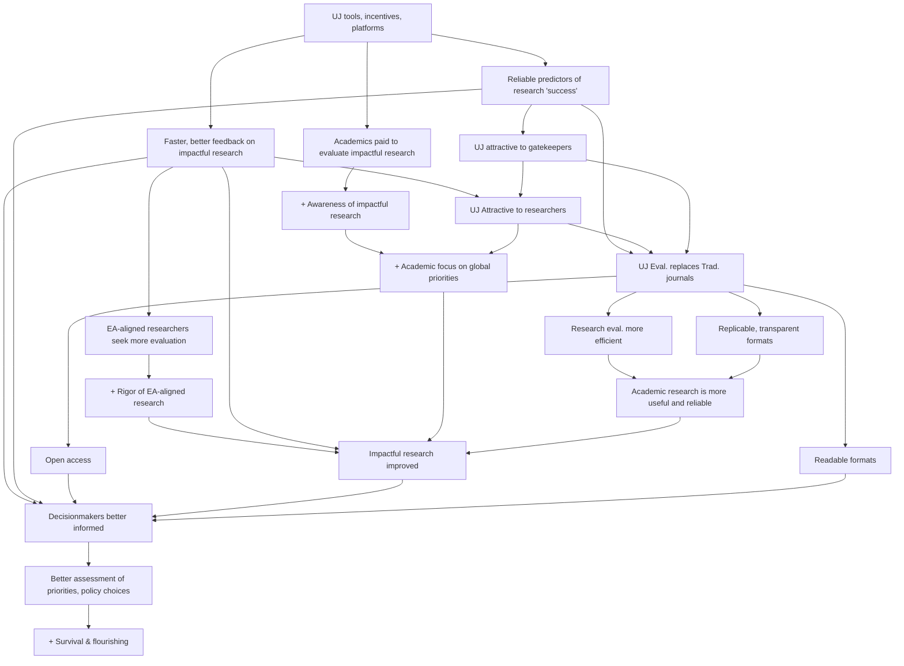

# Global priorities: Theory of Change

See also [acx-ltff-grant-proposal-as-submitted-successfull](../../grants-and-proposals/acx-ltff-grant-proposal-as-submitted-successfull/ "mention")

All of our ToC paths (shown above) begin with our setting up, funding, communicating, and incentivizing participation in a strong, open, efficient research evaluation system. These all and lead to impactful research being more in-depth, more reliable, more accessible, and more useful, better informing decisionmakers, and leading to better decisions and outcomes.   \

Highlighting some of the key paths:

1. Faster and better feedback on impactful research will better inform policymakers and philanthropists.
2. The Unjournal’s more efficient, open, and flexible processes will become attractive to academics and stakeholders. As we become better at ‘predicting publication outcomes’, we will become a replacement for traditional processes,  improving research overall (some of which will be highly impactful research).&#x20;

* This process will also nudge mainstream academics towards focusing on impact and global priorities, and towards making their research and outputs more accessible and useable.&#x20;

3\. Our processes and incentives will foster ties between mainstream/prominent/academic/policy researchers and global-priorities/EA-focused researchers. This will improve the rigor, credibility, exposure, and influence of previously ‘EA niche’ work, while helping mainstream researchers better understand and incorporate ideas, principles and methods from the EA and rationalist research communities (counterfactual impact, cause-neutrality, reasoning transparency, etc.)&#x20;
