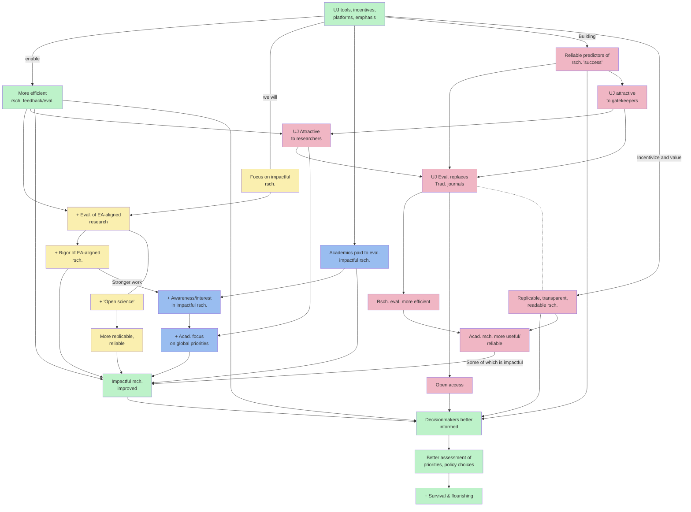
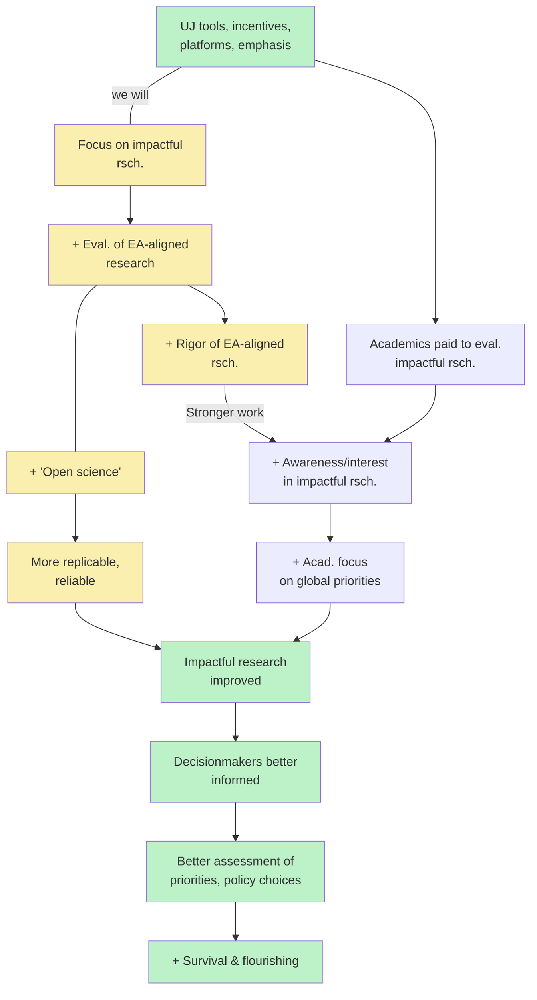

# Global priorities: Theory of Change



Our _theory of change_ is shown above as a series of possible paths; we indicate what is arguably the most "direct" path in yellow. All of these begin with our setting up, funding, communicating, and incentivizing participation in a strong, open, efficient research evaluation system (in green, at the top). These processes all lead to impactful research being more in-depth, more reliable, more accessible, and more useful, better informing decision-makers and leading to better decisions and outcomes (in green, at the bottom).

Highlighting some of the key paths:

1. (Yellow) Faster and better feedback on impactful research improves this work and better informs policymakers and philanthropists (yellow path).
2.  (Blue) Our processes and incentives will foster ties between mainstream/prominent/academic/policy researchers and global-priorities or EA-focused researchers. This will improve the rigor, credibility, exposure, and influence of previously "EA niche" work while helping mainstream researchers better understand and incorporate ideas, principles, and methods from the EA and rationalist research communities (such as counterfactual impact, cause-neutrality, reasoning transparency, and so on.)

    \
    This process will also nudge mainstream academics towards focusing on impact and global priorities, and towards making their research and outputs more accessible and useable.
3. (Pink) _The Unjournal_’s more efficient, open, and flexible processes will become attractive to academics and stakeholders. As we become better at "predicting publication outcomes," we will become a replacement for traditional processes, improving research overall—some of which will be highly impactful research.

## Detailed explanations of key paths

### _Rapid, informative, transparent feedback and evaluation to inform policymakers and researchers_

Rigorous quantitative and empirical research in economics, business, public policy, and social science has the potential to improve our decision-making and enable a flourishing future. This can be seen in the research frameworks proposed by 80,000 Hours, Open Philanthropy, and The Global Priorities Institute (see [discussions here](../../the-field-and-ea-gp-research.md)). This research is routinely used by effective altruists working on global priorities or existential risk mitigation. It informs both philanthropic decisions (e.g., those influenced by [GiveWell's Cost-Effectiveness Analyses](https://www.givewell.org/how-we-work/our-criteria/cost-effectiveness/cost-effectiveness-models), whose inputs are largely based on academic research) and [national public policy](https://academic.oup.com/ser/article/12/4/779/1653602).\
\
Unfortunately, the academic publication process is notoriously slow; for example, in economics, it [routinely takes 2–6 years](https://www.nber.org/papers/w29147) between the first presentation of a research paper and the eventual publication in a peer-reviewed journal. Recent reforms have sped up parts of the process by encouraging researchers to put working papers and preprints online.

However, working papers and preprints often receive at most only a cursory check before publication, and it is up to the reader to judge quality for themselves. Decision-makers and other researchers rely on peer review to judge the work’s credibility. This part remains slow and inefficient. Furthermore, it provides very noisy signals: A paper is typically judged by the "prestige of the journal it lands in"’ (perhaps after an intricate odyssey across journals), but it is hard to know why it ended up there. Publication success is seen to depend on personal connections, cleverness, strategic submission strategies, good presentation skills, and relevance to the discipline’s methods and theory. These factors are largely irrelevant to whether and how philanthropists and policymakers should consider and act on a paper’s claimed findings. Reviews are kept secret; the public never learns why a paper was deemed worthy of a journal, nor what its strengths and weaknesses were.

We believe that disseminating research sooner—along with measures of its credibility—is better.

We also believe that publicly evaluating its quality before (and in addition to) journal publication will add substantial additional value to the research output, providing:

1. a quality assessment (by experts in the field) that can decisionmakers and other researchers can read alongside the preprint, helping these users weigh its strengths and weaknesses and interpret its implications; and
2. faster feedback to authors focused on improving the rigor and impact of the work.

Various initiatives in the life sciences have already begun reviewing preprints. While economics took the lead in sharing working papers, public evaluation of economics, business, and social science research is rare. _The Unjournal_ is the first initiative to publicly evaluate rapidly-disseminated work from these fields. Our specific priority: research relevant to global priorities.

<details>

<summary>So, how does this contribute to better 'survival and flourishing' outcomes?</summary>

_The Unjournal_ will encourage and incentivize substantive and helpful feedback and careful quantitative evaluation. We will publish these evaluations in a carefully curated space, and clearly aggregate and communicate this output.

This will help us achieve our focal, most tangible "theory of change" pathway (mapped in our "Plan for Impact"):

* Better (faster, public, more thorough, more efficient, quantified, and impact-minded) evaluation of pivotal research
* makes this research better (both the evaluated work and adjacent work) and encourages more such work
* and makes it easier for decision makers to evaluate and use the work, leading to better decisions and better outcomes,
* thus reducing X-risk and contributing to long-term survival and flourishing.

</details>

### Faster, better feedback; attractiveness to researchers and gatekeepers; improved research formats; and better and more useful research

_The Unjournal_’s open feedback should also be valuable to the researchers themselves and their research community, catalyzing progress. As the _Unjournal_ Evaluation becomes a valuable outcome in itself, researchers can spend less time "gaming the journal system." Shared public evaluation will provide an important window to other researchers, helping them better understand the relevant cutting-edge concerns. _The Unjournal_ will permit research to be submitted in a wider variety of useful formats (e.g., dynamic documents and notebooks rather than "frozen pdfs"), enabling more useful, replicable content and less time spent formatting papers for particular journals. We will also allow researchers to improve their work _in situ_ and gain updated evaluations, rather than having to spin off new papers. This will make the literature more clear and less cluttered.


## "Some of the main paths"



```


```

<details>

<summary>Achieving system change in spite of collective action issues</summary>

Some of the paths will take longer than others; in particular, it will be hard to get academia to change, particularly because of entrenched systems and a collective action problem. We discuss how we hope to overcome this [HERE](https://effective-giving-marketing.gitbook.io/unjournal-x-ea-and-global-priorities-research/#it-sounds-great-but-can-you-really-change-things). In particular, we can provide leadership and take risks that academics won’t take themselves:

* Bringing in new interests, external funding, and incentives can change the fundamental incentive structure.
* We can play a long game and build our processes and track record while we wait for academia to incorporate journal-independent evaluations directly into their reward systems. Meanwhile, our work and output will be highly useful to EA and global-priorities longtermist researchers and decision makers as part of their metrics and reward systems.
* _The Unjournal_’s more efficient, open, and flexible processes will become attractive to academics and stakeholders. As we become better at "predicting publication outcomes," we will become a replacement for traditional processes, improving research overall—some of which will be highly impactful research.
* This process will also nudge mainstream academics towards focusing on impact and global priorities, and towards making their research and outputs more accessible and useable.

</details>
