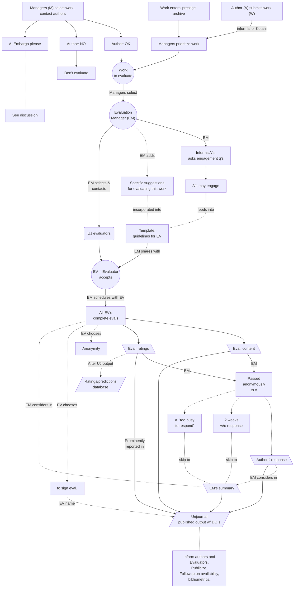

# Mapping evaluation workflow

##

## Initial sketch, revised 8 Feb '23

1. &#x20;Author creates new submission (submits a URL and DOI)
   * Alt: Project submitted independently of authors; authors asked/informed
   * Alt: see [direct-evaluation-track.md](../policies-projects-evaluation-workflow/considering-projects/direct-evaluation-track.md "mention")
2. Author (or someone on their behalf) completes a submission form&#x20;
   * This includes a potential 'request for embargo' or other special treatment
3. Manager(s)[^1]  (M) prioritizes work for review (see [considering-projects](../policies-projects-evaluation-workflow/considering-projects/ "mention")),&#x20;
   * M fills in additional information (in same 'submission form') explaining why it's relevant, what to evaluate, etc.
   * Decides whether to grant embargo/special treatment, notes this
4. M assigns Evaluations Manager (EM) to selected project
5. EM invites Evaluators (aka 'Reviewers'), sharing the paper to be evaluated, and a brief summary of why the UJ think it's relevant, and what we are asking. Potential evaluators given full access to (almost) all information submitted by author and ME, notified of any embargo/special treatment granted. May make special requests to evaluator (e.g., 'signed/unsigned evaluation only', short deadlines, extra incentives, etc.)
6. Evaluator accepts/declines invitation to review, agrees on deadline (or asks for extension)
   * EM shares full guidelines and suggestions with evaluator
7. Evaluator completes a review form (atm this includes an out-link to a gdoc or survey, allowing better-formatted content and input options); we aim to embed this in a system ... [kotahi-submit-eval-mgmt.md](../management-tech-details-discussion/hosting-and-platforms/kotahi-submit-eval-mgmt.md "mention")
8. Evaluator submits evaluation including numeric ratings and predictions, confidence intervals
   * _Possible addition (future plan)_: Reviewer asks for 'minor revisions and corrections; see 'considering: allowing minor revisions' in fold below
9. HE collates all reviews/ratings, shares these with Author, notifies evaluators this was done
   * Be very careful not to share evaluators' identities, unless the specifically requested this
     * [Especially where evaluators chose anonymity](#user-content-fn-2)[^2]
     * Even if evaluators chose to 'sign their evaluation', do not disclose their identity to authors at this point, but tell evaluators they can reach out to [the authors if they desire](#user-content-fn-3)[^3]
   * Share evaluations with the authors as separate doc/file/space; which [the evaluators _do not have automatic access to_](#user-content-fn-4)[^4]_._
   * Make it clear to authors: their responses will be published (and given a DOI when we can).
10. Author(s) reads evaluations, given two weeks to submit responses
    * _If there is an embargo, there is more time to do this, of course_
11. &#x20;EV creates evaluation summary, publishes all evaluations and author response&#x20;
    * ... If no embargo, otherwise wait until after embargo ends/authors release it
12. This feeds into our [PubPub](https://unjournal.pubpub.org/) space&#x20;

    * DOIs for each element

## Considering for future: enabling  'minor revisions'

In our current (8 Feb 2023: Pilot) phase, we have the evaluators consider the paper 'as is', frozen at a certain date, with no room for revisions. The authors can of course revise the paper on their own, and even pursue an updated Unjournal review; and we would like to include links to the 'permanently updated version' in the Unjournal evaluation space.

_After the pilot, we may consider making minor revisions part of the evaluation process._ This may add substantial value to the papers and process, especially where evaluators identify straightforward and easily-implementable _improvements._&#x20;

How revisions might be folded into the above flow

_If 'minor revisions' are requested_:&#x20;

* ...  the author has 4 weeks (strict) to make these if they want to, submit a new linked manuscript, and also submit their response to the evaluation.
* _Optional_: Reviewers can comment on any minor revisions _and adjust their rating_

### **Why would we (potential consider) only 'minor' revisions?**

We don't want to replicate the slow and inefficient processes of the traditional system. We want evaluators to basically give a report and rating _as the paper stands._&#x20;

We also want to encourage papers as [permanent-beta ](../benefits-and-features/living-research-projects.md)projects. The authors can improve it, if they like, and resubmit it for a new evaluation.&#x20;

[^1]: These may come from our Management Team, Advisory Board, or paid and contacted staff

[^2]: Where evaluators chose anonymity, none of their evaluation content should be linked to their real names or identity by design. Still, doublecheck this.

[^3]: The evaluators can also ask us to disclose their identity and contact info to the authors at this point, to save them the hassle

[^4]: Make this clear to authors. Authors can reach out to evaluators and share any of this if they wish, but they are not required to do so.&#x20;
