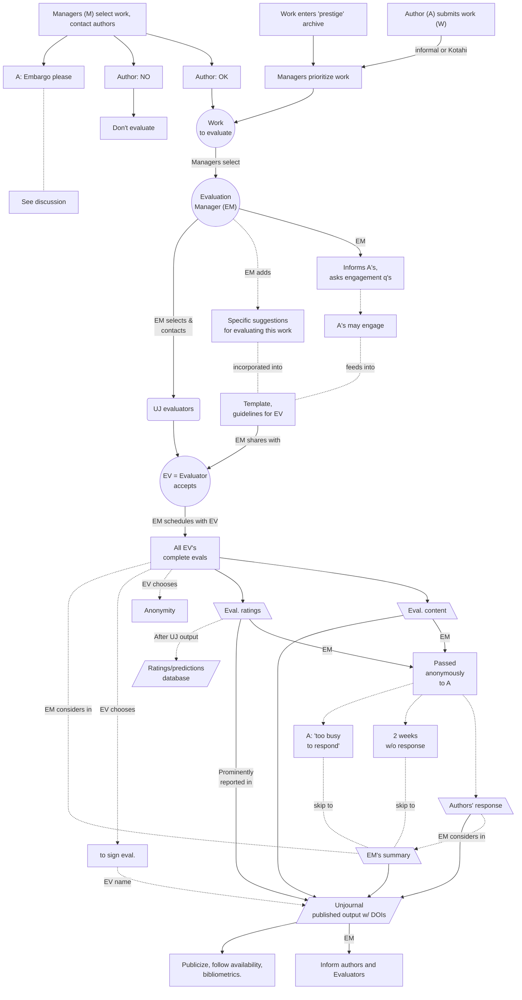

# Mapping evaluation workflow

The flowchart below focuses on the _evaluation_ part of our process.

## Describing key steps above (updated 10 May '23)

1. Submission/selection
   1. Author (A) submits work (W), creates new submission (submits a URL and DOI), through our platform or informally
      * Author (or someone on their behalf) can complete a _submission form;_ this includes a potential 'request for embargo' or other special treatment
   2. Managers select work to prioritize, or the project is submitted independently of authors
      * For either of these cases (1 or 2), authors are asked for _permission_
   3. Alternate [direct-evaluation-track.md](../policies-projects-evaluation-workflow/considering-projects/direct-evaluation-track.md "mention")), 'Work enters prestige archive' (currently NBER).
      * Here authors are informed and consulted, but permission is not needed
2. Prioritization
   * (Following author submission) ...
     * Manager(s) (M) prioritizes work for review (see [considering-projects](../policies-projects-evaluation-workflow/considering-projects/ "mention")),
   * (Following direct evaluation selection)...
     * M fills in additional information explaining why it's relevant, what to evaluate, etc.
   * If requested (in either case), decides whether to grant embargo/special treatment, notes this, informs authors
3. M assigns Evaluations Manager (EM) to selected project (typically part of our [management team or advisory board](../readme/discussion-team/))
4. EM invites Evaluators (aka 'Reviewers'), sharing the paper to be evaluated, and a brief summary of why the UJ thinks it's relevant, and what we are asking.
   * Potential evaluators given full access to (almost) all information submitted by author and ME, notified of any embargo/special treatment granted.
   * EM may make special requests to evaluator (e.g., 'signed/unsigned evaluation only', short deadlines, special focus, extra incentives, etc.)
5. Evaluator accepts/declines invitation to review, agrees on deadline (or asks for extension)
   * If accepts, EM shares full guidelines/evaluation template and specific suggestions with evaluator
6. Evaluator completes [an evaluation form](#user-content-fn-1)[^1]; we aim to embed this in a system, e.g., [kotahi-submit-eval-mgmt.md](../tech-tools-and-resources/hosting-and-platforms-notes/kotahi-sciety-phasing-out/kotahi-submit-eval-mgmt.md "mention")
7. Evaluator submits evaluation including numeric ratings and predictions, "CI's" for these
   * _Possible addition (future plan)_: Reviewer asks for 'minor revisions and corrections; see 'considering: allowing minor revisions' in fold below
8. EM collates all evaluations/ratings, shares these with Author, notifies evaluators this was done
   * Be very careful not to share evaluators' identities at this point
     * Especially where evaluators chose anonymity, be extra-careful there is no accidentally-identifying information
     * Even if evaluators chose to 'sign their evaluation', do not disclose their identity to authors at this point, but tell evaluators they can reach out to [the authors if they desire](#user-content-fn-2)[^2]
   * Share evaluations with the authors as separate doc/file/space; which [the evaluators _do not have automatic access to_](#user-content-fn-3)[^3]_._
   * Make it clear to authors: their responses will be published (and given a DOI when we can).
9. Author(s) reads evaluations, given two weeks to submit responses
   * _If there is an embargo, there is more time to do this, of course_
10. EM creates evaluation summary and 'EM comments'
11. UJ team publishes each element on our [PubPub](https://unjournal.pubpub.org/) space as a separate 'pub' with a DOI for each (unless embargoed)
    1. Summary and EM comments,
       1. With a prominent section for the 'ratings data/tables'
    2. Each evaluation (with summarized ratings at the top)
    3. Author response
       * All of the above are linked in a particular way, with particular settings; [see notes](https://docs.google.com/document/d/18Yr95JbeCrDOrn4GpYWamxj2ZcOp9Ex\_arfz-7jZnko/edit)
12. Inform authors and evaluators after this is on PubPub, promote, check bibliometrics, etc.
13. ('Ratings and predictions data' to enter an additional public database)

## Considering for future: enabling 'minor revisions'

In our current (8 Feb 2023: Pilot) phase, we have the evaluators consider the paper 'as is', frozen at a certain date, with no room for revisions. The authors can of course revise the paper on their own, and even pursue an updated Unjournal review; and we would like to include links to the 'permanently updated version' in the Unjournal evaluation space.

_After the pilot, we may consider making minor revisions part of the evaluation process._ This may add substantial value to the papers and process, especially where evaluators identify straightforward and easily-implementable _improvements._

How revisions might be folded into the above flow

_If 'minor revisions' are requested_:

* ... the author has 4 weeks (strict) to make these if they want to, submit a new linked manuscript, and also submit their response to the evaluation.
* _Optional_: Reviewers can comment on any minor revisions _and adjust their rating_

### **Why would we (potential consider) only 'minor' revisions?**

We don't want to replicate the slow and inefficient processes of the traditional system. We want evaluators to basically give a report and rating _as the paper stands._

We also want to encourage papers as [permanent-beta ](../benefits-and-features/living-research-projects.md)projects. The authors can improve it, if they like, and resubmit it for a new evaluation.

1. This might occur through the same 'submission form' authors complete
2. Where evaluators chose anonymity, none of their evaluation content should be linked to their real names or identity by design. Still, doublecheck this.
3. We recently were compiling these into a single Gdoc, but this is adding extra work; for now sharing separate files with the author seems a better intermediate solution, until we build an ed. management system.
4. If an embargo was granted, until after embargo ends or authors release itear

[^1]: Atm this is an out-link to a Googe Doc.

[^2]: The evaluators can also ask us to disclose their identity and contact info to the authors at this point, to save them the hassle

[^3]: Make this clear to authors. Authors can reach out to evaluators and share any of this if they wish, but they are not required to do so.
