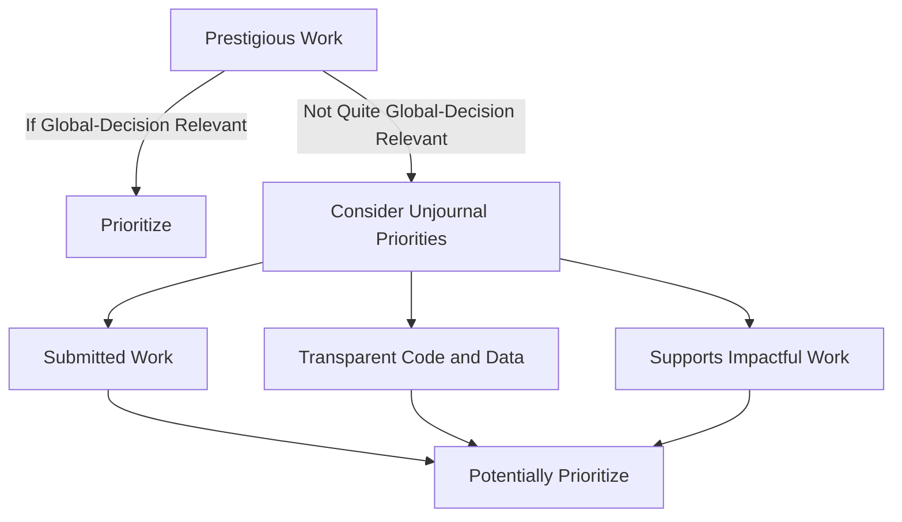
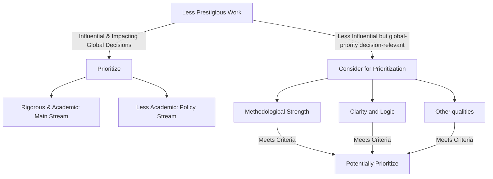

# Prioritization ratings: discussion

As noted in [process-prioritizing-research-for-evaluation-wip.md](../process-prioritizing-research-for-evaluation-wip.md "mention"), we ask people who suggest research to provide a numerical 0-100 rating:

<figure><figcaption></figcaption></figure>

We also ask people within our team to act as 'assessors' to give as second and third opinions on this.  This 'prioritization rating' is one of the criteria we will use to determine whether to commission research to be evaluated (along with author engagement, publication status, our capacity and expertise, etc.)  Again, see the [previous page](../process-prioritizing-research-for-evaluation-wip.md) for the current process.

### _**So what goes into this "prioritization rating"; what does it mean?**_&#x20;

We are working on a set of notes on this,  fleshing this out and giving specific examples. At the moment this is available to members of our team only (ask for access to "Guidelines for prioritization ratings (internal)"). We aim to share a version of this publicly once it converges, and once we can get rid of arbitrary sensitive examples.&#x20;

#### Some key points

I. This is not the evaluation itself. It is _not_ an evaluation of the paper's merit per se:

* _Influential work, and prestigious work in influential areas_ may be highly prioritized regardless of its rigor and quality
* The prioritization rating might consider quality for work that seems potentially impactful, which does _not_ seem particularly prestigious or influential. Here aspects like writing clarity, methodological rigor, etc., might put it 'over the bar'. However, even here _these will tend to be based on rapid and shallow assessments_, and should not be seen as meaningful evaluations of research merit.

II. These ratings will be considered _along with the discussion_ by the field team and the management. Thus is helpful if you give a justification and explanation for your stated rating.

## One possible way of considering the rating criteria

## Key attributes/factors

Define/consider the following ‘attributes’ of a piece of research:

1. Global decision-relevance/VOI: Is this research decision-relevant to high-value choices and considerations that are important for global priorities and global welfare?\

2. Prestige/prominence: Is the research already prominent/valued (esp. in academia), highly cited, reported on,  etc?\

3. Influence: Is the work already influencing important real-world decisions and considerations?

_Obviously, these are not binary factors; there is a continuum for each. But for the sake of illustration, consider the following flowcharts._&#x20;


If the flowcharts do not render, please refresh your browser.


### Prestigious work

_**Decision-relevant, prestigious work:**_ Suppose the research is both ‘globally decision-relevant’ and prominent. Here, if the research is in our domain, we probably want to have it publicly evaluated. This is basically the case regardless of its apparent methodological strength. This is particularly true if it has been recently made public (as a working paper), if it has not yet been published in a highly-respected peer-reviewed journal, and if there are non-straightforward methodological issues involved. \

_**Prestigious work that seems less globally-relevant:**_ We generally will not prioritize this work unless it adds to our mission in other ways (see, e.g., our ‘sustainability’ and ‘credibility’ goals [here](https://globalimpact.gitbook.io/the-unjournal-project-and-communication-space/policies-projects-evaluation-workflow/considering-projects/what-research-to-target#b.-sustainability-funding-support-participation)). In particular we will prioritize such research more if:

* It is presented in innovative, transparent formats (e.g.,  dynamic documents/open notebooks, sharing code and data)
* The research indirectly supports more globally-relevant research, e.g., through…&#x20;
  * Providing methodological tools that are relevant to that ‘higher-value’ work
  * Drawing attention to neglected high-priority research fields (e.g., animal welfare)

### Less prestigious work

_(If the flowchart below does not render, please refresh your browser.)_

_**Decision-relevant, influential (but less prestigious) work:**_ E.g., suppose this research might be cited by a major philanthropic organization as guiding its decision-making, but the researchers may not have strong academic credentials or a track record. Again, if this research is in our domain, we probably want to have it publicly evaluated. However, depending on the rigor of the work and the way it is written, we may want to explicitly class this in our ‘non-academic/policy’ stream.\

**Decision-relevant, less prestigious, less-influential work:** What about for less-prominent work with fewer academic accolades that is not yet having an influence, but nonetheless seems to be globally decision-relevant? Here, our evaluations seem less likely to have an influence unless the work seems potentially strong, implying that our evaluations, rating, and feedback could boost potentially valuable neglected work. Here, our prioritization rating might focus more on our initial impressions of things like …&#x20;

* Methodological strength (this is a big one!)
* Rigorous logic and communication
* Open science and robust approaches
* Engagement with real-world policy considerations

_Again: the prioritization process is not meant to be an evaluation of the work in itself. It’s OK to do this in a fairly shallow way._&#x20;

In future, we may want to put together a loose set of methodological ‘suggestive guidelines’ for work in different fields and areas, without being too rigid or prescriptive. (To do: we can draw from some existing frameworks for this \[ref].)

&#x20;

\
\
