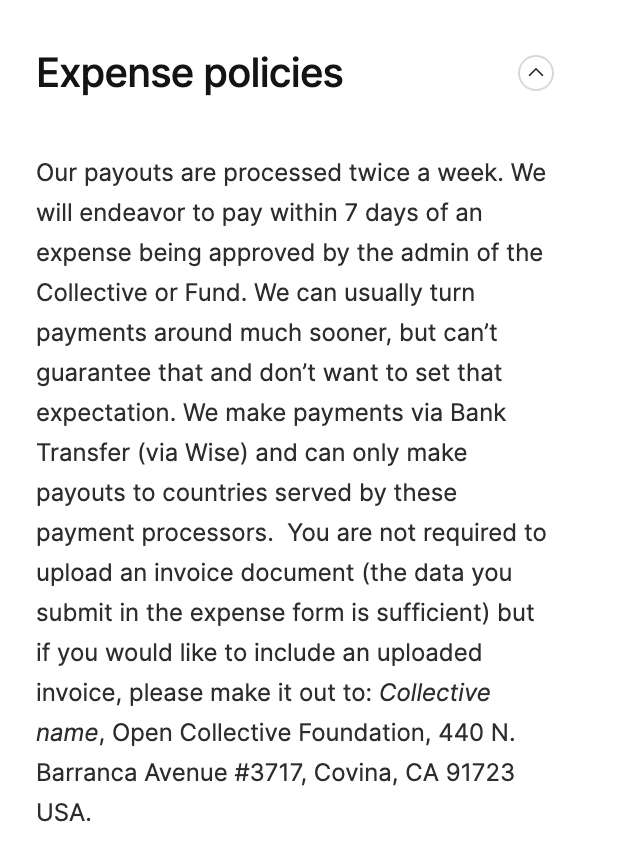

# Guidelines for Evaluators


_**Thanks for your interest in evaluating research for the Unjournal!**_

Your evaluation will be made public and given a DOI, but you have the option to remain anonymous or 'sign your review' and take credit. You will be compensated a [minimum of $250 for your evaluation work](#user-content-fn-1)[^1], and will be eligible for financial 'most informative evaluation' prizes. See the guidelines below. You can submit your response in [this form](https://docs.google.com/document/d/1erOQ8qiWmgAmd9WdMLmuBGoxFkUJeQo2c8pc5wFAQbk/edit) ([Google Doc](#user-content-fn-2)[^2])**,** and share it back with us.

_Click_ [_HERE_](https://docs.google.com/document/d/1erOQ8qiWmgAmd9WdMLmuBGoxFkUJeQo2c8pc5wFAQbk/copy) _to directly make a new copy of this form._


_If you wish, you can download the current page as a pdf_ [_HERE_](https://www.dropbox.com/s/jzxz11gmkrh8lbn/evaluations\_as\_pdf.pdf?dl=0)_, with all folded boxes open. (updated_ 20 Mar 2023)

Payment amounts discussed, submitting claims

We aim to increase these payments going forward and are applying for funds to do this. "Pilot" reviewers will be given an extra payment for helping us evaluate the system. We may occasionally offer additional payments for specifically requested evaluation tasks.

See: [broken-reference](broken-reference/ "mention")


[_**How and why did we decide on these guidelines?**_](#user-content-fn-3)[^3]


## What we would like you to do

1. _**Write a review:**_ a ‘standard high-quality referee report’, with some [specific considerations](#user-content-fn-4)[^4].
2. _**Give quantitative metrics and predictions** as requested in the_ [_two tables below_](#user-content-fn-5)[^5], as appropriate.
3. _Answer a short questionnaire about your background and our processes._

## Writing the report

**In writing your report, please consider the following:**

Specific requests for focus/feedback

Please pay attention to anything our managers/editors specifically asked you to focus on. We may ask you to focus on specific areas of expertise; you do not need to address all aspects of the work. We may also forward specific feedback requests from authors.

The Unjournal's criteria

For the most part, this is like a 'standard journal review', but we have some particular priorities. See [#category-explanations-what-you-are-rating](./#category-explanations-what-you-are-rating "mention") for guidance. For example, we would like to prioritize impact and robustness over cleverness.

<strong>Remember: t</strong>his review (and ratings) will be made public

Unless you were advised otherwise, it will be given a DOI, and hopefully it will enter the public research conversation. Note that the authors will be given two weeks to respond to reviews, before the evaluations, ratings and the responses are made public. You will be given a _choice_ of whether you want to be publicly listed as an author of the review.

_If you have questions or clarifications about the authors’ work, you can ask them these questions anonymously; we will facilitate it._

Publishing and signing reviews: considerations/exceptions

We are considering the best policy towards signed reviews vs. single-blind reports; for now we give evaluators the option to choose. We may change this policy in the future. We are also considering the best 'single blind vs signed reviews' policies going forward. We may also make some exceptions to the public evaluations policy in the future; reviewers will be informed in advance.

* We may give early-career researchers the right to veto the publication of very negative reviews, or to embargo the release of these reviews for a defined period. We will inform you in advance if this will be the case for your evaluation.

<!---->

* You can reserve some ‘sensitive’ content in your report to be shared with only the Unjournal management or only the authors, but we hope to keep this limited.


_Suggestion to evaluators:_ The [#category-metrics](./#category-metrics "mention") and[#overall-metrics-holistic-assessment](./#overall-metrics-holistic-assessment "mention") outline our evaluation priorities. You may want to look at these metrics _before_ writing your review, and then return to them afterwards.


### A **‘standard high-quality referee report'**

We are generally asking for a ‘standard high-quality referee report’ here; the sort of report an academic [would write for a traditional high-prestige journal](#user-content-fn-6)[^6]. We are asking for this, subject to some differences in priorities, which we discuss below, and subject to any particular requests the managing editor may communicate to you.

**Length and time spent:** This is up to you. We welcome detail, elaboration, and technical discussion.

Length and time: possible benchmarks

[The Econometrics society](https://www.econometricsociety.org/publications/econometrica/browse/guidelines-referees) recommends a 2-3 page referee report; [Berk et al](https://pubs.aeaweb.org/doi/pdfplus/10.1257/jep.31.1.231) suggest this is relatively short but that brevity is desirable. [In a recent survey (Charness et al, 2022)](https://evalresearch.weebly.com/report---full-text.html), economists report spending (median and mean) about one day per report, with substantial shares reporting ‘half a day’ and ‘two days’. We expect that reviewers tend spend more time on papers for high-status journals, and when reviewing work closely tied to their own agenda.

## Metrics: overall assessment, categories

_Our general priorities_ are embodied in the quantitative metrics below. We believe these are similar, but not identical, to criteria used by the ‘top journals’ in economics and adjacent fields.


_Below:_ [a 'completed example'](#user-content-fn-7)[^7]. We will give evaluators a concise survey form with everything they need to fill out.


<table><thead><tr><th width="262">Category (importance)</th><th width="112" align="center">Sugg. Wgt.*</th><th width="107" data-type="number">Rating (0-100)</th><th width="115" align="center">90% CI</th><th data-type="rating" data-max="5">Confidence (alt.)</th><th data-hidden></th></tr></thead><tbody><tr><td><a data-mention href="./#overall-assessment">#overall-assessment</a>(holistic, most important!)</td><td align="center"></td><td>44</td><td align="center">39, 52</td><td>4</td><td></td></tr><tr><td><a data-mention href="./#1.-advancing-our-knowledge-and-practice">#1.-advancing-our-knowledge-and-practice</a></td><td align="center">5</td><td>50</td><td align="center">47, 54</td><td>5</td><td></td></tr><tr><td><a data-mention href="./#2.-methods-justification-reasonableness-validity-robustness">#2.-methods-justification-reasonableness-validity-robustness</a></td><td align="center">5</td><td>51</td><td align="center"><em>45, 55</em></td><td>4</td><td></td></tr><tr><td><a data-mention href="./#3.-logic-and-communication">#3.-logic-and-communication</a></td><td align="center">4</td><td>20</td><td align="center"><em>10, 35</em></td><td>3</td><td></td></tr><tr><td><a data-mention href="./#4.-open-collaborative-replicable-science-and-methods">#4.-open-collaborative-replicable-science-and-methods</a></td><td align="center">3</td><td>60</td><td align="center"><em>40, 70</em></td><td>2</td><td></td></tr><tr><td><a data-mention href="./#5.-engaging-with-real-world-impact-quantification-practice-realism-and-relevance">#5.-engaging-with-real-world-impact-quantification-practice-realism-and-relevance</a></td><td align="center">2</td><td>35</td><td align="center"><em>30,46</em></td><td>3</td><td></td></tr><tr><td><a data-mention href="./#6.-relevance-to-global-priorities">#6.-relevance-to-global-priorities</a></td><td align="center">0</td><td>30</td><td align="center">21,65</td><td>1</td><td></td></tr></tbody></table>

_All metrics are explained below under_[#what-we-are-asking-you-to-rate-explanations](./#what-we-are-asking-you-to-rate-explanations "mention")

[_\*Note: "suggested weights"_](#user-content-fn-8)[^8]

_\*\*_[_Note: Relevance to Global Priorities_](#user-content-fn-9)[^9]

_**For each question above, if it seems relevant, and you feel qualified to judge, please ...**_

1. Give a rating from 0-100, considering the _‘what we are asking you to rate’_ discussion provided. Try to follow the scale in[#0-100-metric-explained](./#0-100-metric-explained "mention"), but specifically for this _category._
2. ‘Quantify how certain you are’ about this, either giving a 90% [confidence](https://en.wikipedia.org/wiki/Confidence\_interval)/[credible](https://en.wikipedia.org/wiki/Credible\_interval) interval or using our [scale as described below](./#the-confidence-rating). ([_Please give a 90% CI or a confidence score, but not both._](#user-content-fn-10)[^10] _See explainers and discussion in folds below.)_

But what do these measures mean, and how should I consider the 0-100 metric?

We explain the [categories HERE](https://effective-giving-marketing.gitbook.io/unjournal-x-ea-and-global-priorities-research/policies-projects-evaluation-workflow/evaluation/guidelines-for-evaluators#category-explanations-what-you-are-rating) and the intended metrics scale [HERE](https://effective-giving-marketing.gitbook.io/unjournal-x-ea-and-global-priorities-research/policies-projects-evaluation-workflow/evaluation/guidelines-for-evaluators#0-100-metric-explained) (links below). Your feedback is very welcome.

However, we recognize (as of June 2023) that we have not yet defined our criteria and their metrics precisely; we are working to improve this. We may adopt a more explicit metric, e.g., in terms of 'the distribution of research work typically published in conventional journals with particular tiers'.

Why are you asking about 'confidence' in these metrics?

Ideally, we would like you to state your "confidence intervals" or "credible intervals". Loosely speaking, we hope to capture a sense of 'how sure you are' about your ratings. This will help people seeing your evaluation know how much weight to put on them in using them for making their own decisions. These can also be used in systematic ways for meta-science and meta-analysis. We can 'aggregate expert judgment' to get a better measure of how confident we _should be_ about particular measures and claims.

But how do I come up with these (confidence/credible) intervals here?

You may know most of the concepts below, but you might be unfamiliar with applying these in a situation like this one.

Suppose your best guess for the 'Methods...' criterion is 65. Still, even an expert can never be certain. E.g., you may be misunderstanding some aspect of the paper, there may be a justification or method you are not familiar with, you might not understand the criterion, etc.

Your 'uncertainty' over this could be described by some distribution, representing your beliefs about the _true value_ of this criterion. By 'true value', you might think 'if you had all the evidence, knowledge, and wisdom in the world, and the benefit of perfect hindsight, what value would you choose for this criterion?'.

Your 'best guess' should (basically) be the central mass point of this distribution.

You are asked to give a 90% interval. Loosely speaking, you could consider something like "what is the smallest interval around this best guess that I believe is 90% likely to contain the true value".

E.g., you might think:

"I am going to interpret the 'methods' in terms of their reliability for consistent causal inference and minimizing parameter mean-squared-error in settings like this one."

"I see the suggested [metrics scale](./#category-explanations-what-you-are-rating). Although this scale gives descriptive criteria, I think the best interpretation of this metric would consider appropropriateness of the methods chosen relative to the choices made across the distribution of all papers published in any top-50-or-above-impact-factor-rated journal in economics. My best/central guess is that this paper falls into the 65th percentile for this."

"I have made intuitive judgments on questions like this in the past. I sometimes changed my mind a bit. Considering this in context, I am only somewhat confident in my judgment here. I'm unsure about the diagnostic tests for the two-way fixed-effects. I'd put about a 10% probability that this work is actually in the bottom-45% of all work submitted to such journals. On the other hand, if these diagnostic tests were powerful, this would be among the strongest work in this respect. Thus, I'd give a 10% chance that this is in the top-10% of such work in this sense."

"Thus, I give a central score of '65' for this metric, with 90% bounds '(45, 90)'"

Are you setting these bounds well? 'Calibration': judging your own uncertainty

"But how do I know if I'm setting these bounds right?"

One consideration is "calibration". If you're well-calibrated, then your specified 90% bounds should contain the true value close to 90% of the time. Similarly, 50% bounds should contain the true value half the time.\
\
If your 90% bounds contain the true value _less_ than 90% of of the time, you're being _overconfident_ (try to give wider bounds in the future). If they contain the true value more than 90% of the time, you are _underconfident_ (specify tighter bounds going forward).

To understand this better, assess your ability, and get better at this, see ['calibrated probability assessment](https://www.wikiwand.com/en/Calibrated\_probability\_assessment)' and tools like '[calibrate your judgment](https://www.clearerthinking.org/tools/calibrate-your-judgment)'.

"The aim of the web app is to help you become “well-calibrated.” This means that when you say you’re 50% confident, you’re right about 50% of the time; when you say you're 90% confident, you're right about 90% of the time; and so on."

###

### Overall assessment


We see 'overall assessment' as the most important measure. Please prioritize this.


Judge the work’s quality heuristically. Consider all aspects of quality, importance to knowledge production, and importance to practice. As noted above, we give ‘suggested weights’ (0-5) to suggest the importance of each category rating to your overall assessment, given the Unjournal's priorities. [_But you don't need, and may not want, to use these weightings precisely._](#user-content-fn-11)[^11]

###

### 0-100 Metric explained

_The description folded below focuses on the "Overall Assessment". Please try to use a similar scale when evaluating the category metrics._

Top ratings (90-100)

**95-100:** Among the highest quality and most important work you have ever read.

**90-100:** This work represents a major achievement, making substantial contributions to the field and practice. Such work would/should be weighed very heavily by tenure and promotion committees, and grantmakers.

_For example_

* Most work in this area in the next ten years will be influenced by this paper

<!---->

* This paper is substantially more rigorous or more insightful than existing work in this area in a way that matters for research and practice

<!---->

* The work makes a major, perhaps decisive contribution to a case for (or against) a policy or philanthropic intervention\\

Near-top (75-89) (*)

This work represents a strong and substantial achievement. It is highly rigorous, relevant, and well-communicated, up to the standards of the strongest work in this area (say, the standards of the top 5% of committed researchers in this field). Such work would/should not be decisive in a tenure/promotion/grant decision alone, but it should make a very solid contribution to such a case.

Middle ratings (40-59, 60-74) (*)

[**60-74.9**](#user-content-fn-12)[^12]**:** A very strong, solid, and relevant piece of work. It may have minor flaws or limitations, but overall it is very high-quality, meeting the standards of well-respected research professionals in this field.

**40-59.9:** A useful contribution, with major strengths, but also some important flaws or limitations.

Low ratings (5-19, 20-39) (*)

**20-39.9:** Some interesting and useful points and some reasonable approaches, but only marginally so. Important flaws and limitations. Would need substantial refocus or changes of direction and/or methods in order to be a useful part of the research and policy discussion.

**5-19.9:** Among the lowest quality papers; not making any substantial contribution and containing fatal flaws. The paper may be fundamentally addressing an issue that is not defined or obviously not relevant, or the content may be substantially outside of the authors’ field of expertise.

**0-4:** Illegible, fraudulent, or plagiarized. _Please flag fraud, and notify us and the relevant authorities._

(*) 20 Mar 2023: We adjusted these ratings to avoid overlap

The previous categories were 0-5, 50-20, 20-40, 40-60, 60-75, 75-90, and 90-100. Some evaluators found the overlap in this definition confusing.

### The confidence rating

#### **What are we looking for and why?**

We want policymakers and researchers to be able to _use_ The Unjournal's evaluations to carefully update their beliefs and make better decisions. To do this well, they need to weigh multiple evaluations against each other, and against other sources of information. How much weight should they give to each? In this context it is important to _quantify the uncertainty_. That's why we ask you to provide a measure of this. [You may feel comfortable giving your "90% confidence interval", or you may prefer to give a 'descriptive rating' of your confidence (from 'extremely confident' to 'not confident').](#user-content-fn-13)[^13]

"1-5 dots": Explanation and relation to CIs

5 = Extremely confident, i.e., 90% confidence interval spans +/- 4 points or less

4 = Very confident: 90% confidence interval +/- 8 points or less

3 = Somewhat confident: 90% confidence interval +/- 15 points or less

2 = Not very confident: 90% confidence interval, +/- 25 points or less

1 = Not confident: (90% confidence interval +/- more than 25 points)\\

Remember, we would like you to give a 90% CI _or_ a confidence rating (1-5 dots) but not both.

Example of Confidence dots vs CI

The example in the diagram above (click to zoom) illustrates the proposed correspondence.

### **Category explanations: what you are rating**

[_Note that all of these criteria are scales (not binaries_](#user-content-fn-14)[^14]_)._ &#x20;

#### 1. Advancing our knowledge and practice

_Suggested weighting: 5_

("To what extent"...) does the project make a contribution to the field or to practice, particularly in ways that will be relevant to our other criteria?

Less weight to ‘originality and cleverness’...

‘Originality and cleverness’ should be weighted less than the typical journal, because the Unjournal focuses on **impact**. Papers that apply existing techniques and frameworks more rigorously than previous work and/or apply them to new areas in ways that provide **practical** insights for GP (global priorities) and interventions should be highly valued. More weight should be placed on contribution to GP than to the academic field.

Do the insights generated inform our (‘posterior’) beliefs about important parameters and about the effectiveness of interventions? [Note that we do not require a substantial _shift_ in our expectations; ](#user-content-fn-15)[^15]sound and well-presented 'null results' can be valuable.

Does the project leverage and incorporate recent relevant and credible work in useful ways?

#### 2. Methods: Justification, reasonableness, validity, robustness

_Suggested weighting: 5_

Are the methods used well-justified and explained; are they a reasonable approach to answering the question(s) in this context? Are the underlying assumptions reasonable? Are all of the given results justified in the 'methods discussion'?

Are the results/methods likely to be robust to reasonable changes in the underlying assumptions? [Does the author demonstrate this?](#user-content-fn-16)[^16]

Avoiding bias and questionable research practices (QRP): Did the authors take steps to reduce bias from opportunistic reporting and QRP? For example, pre-registration, multiple hypothesis testing corrections, and reporting flexible specifications.

<em>By 'methods' we mean....</em>

We use the term “methods” here broadly; this may include choice/collection of data, experiment or survey design, statistical analysis, and simulation, among others.

#### 3. Logic and communication

_Coherent and clear argumentation, communication, reasoning transparency_

_Suggested weighting: 4_

Are the goals/questions of the paper clearly expressed? Are concepts clearly defined/referenced?

Is the reasoning ‘transparent’? (See, e.g., [Open Philanthropy's guide](https://www.openphilanthropy.org/research/reasoning-transparency/) on reasoning transparency.) Are all of the assumptions and logical steps made clear? Does the logic of the arguments make sense? Is the argument written well enough to make it easy to follow?

Is the data and/or analysis presented relevant to the arguments made? Are the stated conclusions/results consistent with the evidence (or theoretical results/proofs) presented? Are the tables/graphs/diagrams easy enough to understand in the context of the narrative (e.g., no errors in labeling)?

#### 4. Open, collaborative, replicable science and methods

_Suggested weighting: 3_

_**4a. Replicability, reproducibility, data integrity**_

<strong>Explanation</strong>

Would another researcher be able to perform the same analysis and get the same results? Is the method and its details explained sufficiently, in a way that would enable easy and credible replication? For example, a full description of analysis, code and software provided, and statistical tests fully explained. Is the source of the data clear?

Is the necessary data made as widely available as possible, as applicable? Ideally, the cleaned data should also be clearly labeled and explained/legible.

\
_Optional_: Are we likely to be able to construct the output from the shared code (and data)? _Note that_ evaluators are not required to run/evaluate the code; this is at your discretion. However, having a quick look at some of the elements could be helpful. Ideally, the author should give code that allows easy, full replication, for example, a single R script that runs and creates everything, starting from the original data source, and including data cleaning files. This would make it fairly easy for an evaluator to check. For example, see[ this taxonomy of ‘levels of computational reproducibility’](https://bitss.github.io/ACRE/assessment.html#score).

_**4b. Consistency**_

[Do the numbers in the paper (and code output, if checked) make sense? Are they internally consistent throughout the paper?](#user-content-fn-17)[^17]

_**4c. Useful building blocks:**_

Do the authors provide tools, resources, data, and outputs that are likely to enable and enhance future work and meta-analysis?

####

#### 5. Engaging with real-world, impact quantification; practice, realism, and relevance

_Suggested weighting: 2_

Does the paper consider the real-world relevance of the arguments and results presented, perhaps engaging policy and implementation questions?

Is the setup particularly well-informed by real-world norms and practices? “Is this realistic; does it make sense in the real world?”

Optional, desirable, invited:

Authors might be encouraged and should be rewarded for the following.

* Do the authors communicate their work in ways policymakers and decision-makers are likely to understand (perhaps in a supplemental ‘non-technical abstract’), without being misleading and oversimplifying?

<!---->

* Do the authors present practical ‘impact quantifications’ such as cost-effectiveness analyses, or provide results enabling these?

In future we may be able to pay them to do the above, if grant funding permits..

####

#### 6. Relevance to Global Priorities

_Suggested weighting: 0._ [_Why 0?_](#user-content-fn-18)[^18]&#x20;

Is this topic, approach, and discussion [_potentially_ useful](#user-content-fn-19)[^19] to global priorities research and interventions?

## Journal/Prediction metrics

We would like to benchmark our evaluations against 'how research is currently judged.' We want to provide a bridge between the current 'accept or reject' system and an evaluation-based system. We want our evaluations to be taken seriously by universities and policymakers. Thus, we are asking you for _two_ predictions in the table below.\

<table><thead><tr><th width="266">Journal/Prediction metrics</th><th width="299" data-type="number">Predict: journal quality* (0.0-5.0)</th><th width="153">90% CI</th><th data-type="rating" data-max="5">Confidence (alt.)</th><th data-hidden data-type="select"></th><th data-hidden></th></tr></thead><tbody><tr><td>What ‘quality journal’ do you expect this work <em>will</em> this be published in?</td><td>null</td><td><em>lower, upper</em></td><td>1</td><td></td><td></td></tr><tr><td></td><td>null</td><td></td><td>null</td><td></td><td></td></tr><tr><td>Overall assessment on ‘scale of journals'; i.e., quality-level of journal it <em>should be published in.</em></td><td>null</td><td><em>lower, upper</em></td><td>1</td><td></td><td></td></tr><tr><td></td><td>null</td><td></td><td>null</td><td></td><td></td></tr><tr><td>*Note: <em>0= lowest/none, 5= highest/best. See</em> <a href="./#journal-metrics"><em>below</em></a> <em>for some benchmarks and guidelines.</em></td><td>null</td><td></td><td>null</td><td></td><td></td></tr></tbody></table>


\*To better understand what we are asking here, please consult the subsections below:\
"Journal metrics," "What quality journal...," and "Overall assessment on ‘scale of journals'"


### Journal metrics

For the 'prediction’ questions above, we are asking for a ‘journal quality rating prediction’ from 0.0 to 5.0. You can specify up to 2 digits (e.g., “4.4” or “2.0”) We are using this 0-5 metric here (rather than 0-100) as we suspect it is more familiar to academics.

**The metrics are:**

0/5: Marginally respectable/Little to no value. Not publishable in any journal with scrutiny or credible WP series, not likely to be cited by credible researcher

1/5: OK/Somewhat valuable journal;

2/5 Marginal B-journal/decent field journal

3/5: Top B-journal/Strong field journal

4/5: Marginal A-Journal/Top field journal

5/5: A-journal/Top Journal

We give some example journals [HERE](https://docs.google.com/spreadsheets/d/1nnS0FMOIKz-3rFJMn-JsX-6\_oE54gdvCjxs0vac6WF8/edit#gid=0) that may correspond to the above, based on SJR and ABS ratings.

###

### What ‘quality level journal’ do you expect this work to ultimately be published in?

What if this work has already been 'peer-review published'?

The question above presumes that this work has not already been published in a peer-reviewed journal. However, we are planning to commission at least some post-publication review going forward. If the work has already been ‘peer-review-published’ you can either:

* Skip this question _but please still answer the next prediction question, the_ [#overall-assessment-on-scale-of-journals](./#overall-assessment-on-scale-of-journals "mention") or
* Answer a related question (not a prediction): “Suppose this paper were submitted to journals, in succession, from the top tier downwards. Imagine there is some randomness in this process. Consider all possible “random draws of the world”. In the ‘median draw,’ what ‘quality level journal’ would this paper be published in?

"As if you were advising an author"

In presenting your prediction and confidence interval for this, you might want to consider if you were offering advice to an author:

“What journal would be likely to publish this work?”

“What is the most prestigious journal that would consider publishing this?”

“What is the least prestigious journal that the authors should consider submitting this to?" I.e., "I wouldn't go lower, even if I were risk-averse”

Reprising the confidence intervals for this new metric

**From 'five dots' to 'one dot'...**

**5 = Extremely** confident, i.e., 90% confidence interval spans +/- 4 points or less)\*

**4 = Very** confident: 90% confidence interval +/- 8 points or less

**3 = Somewhat** confident: 90% confidence interval +/- 15 points or less

**2 = Not very** confident: 90% confidence interval, +/- 25 points or less

**1 = Not** confident: (90% confidence interval +/- 25 points)

###

### **Overall assessment on ‘scale of journals'**

Consider the scale of journals described above. Suppose that:

1. the journal process was fair, unbiased, and free of noise, and that status, social connections, and ‘lobbying to get the paper published’ didn’t matter, and
2. journals assessed research according to the category metrics we discussed above, and
3. (added June 2023) this research were being submitted to journals according to this fair process.

_In such a case, what ‘quality level journal’ would and should this research be published in its current form or with minor revisions?_

##

## Survey questions


_For the questions below, we will publish your responses and review unless you ask us to keep them anonymous._


1. How long have you been in this field?
2. How many proposals and papers have you evaluated? _(For journals, grants, and other peer-review.)_

_Your answers to the questions below will not be made public:_

1. How would you rate this template and process?
2. Do you have any suggestions or questions about this process or the Unjournal? (We will try to respond, and incorporate your suggestions.) \[Open response]
3. Would you be willing to consider evaluating a revised version of this project?

##

## **How to write a good review (general conventional guidelines)**

Some general key points to consider

* Cite evidence and reference specific parts of the research when giving feedback.
* Try to justify your critiques and claims in a reasoning transparent way, rather than merely ‘passing judgment’.
* Provide specific, actionable feedback to the author where possible.
* When considering the authors’ arguments, consider the most-reasonable interpretation of what they have written (and state what that is, to help the author make their point more clearly). See ‘[steelmanning](https://www.lesswrong.com/tag/steelmanning)’.
* Be collegial and encouraging, but also rigorous. Criticize and question specific parts of the research without suggesting criticism of the _researchers themselves._

We are happy for you to use whichever process and structure you feel comfortable with when writing a peer review.

One possible structure:

_Core_

* Assign an overall score based on quantitative metrics (possible: brief discussion of these metrics).
* Summarize the work and issues, and the research in context to convey your understanding and help others understand it.
* Highlight positive aspects of the paper, strengths and contributions.
  * Assess the contribution of the work in context of existing research.
* Note major limitations and potential ways the work could be improved; where possible, reference methodological literature and discussion, and work that ‘does what you are suggesting’.

_Optional_

* Discuss minor flaws and their potential revisions.
  * You are not obliged/paid to spend a great deal of time copy-editing the work. If you like, you can give a few specific suggestions and then suggest that the author look to make other changes along these lines.
* Offer suggestions for research agendas, increasing the impact of the work, incorporating the work into global priorities research and impact evaluations, and enhancing future work.


**Remember**: The Unjournal doesn’t “publish” and doesn’t “accept or reject”. So don’t give an “Accept, Revise and Resubmit, Reject, etc.” recommendation. We just want quantitative metrics, some written feedback, and some relevant discussion.



'This paper is great, I would accept it without changes, what should I write/do?

_We still want your evaluation and ratings. Some things to consider as an evaluator in this situation._

1. We still want your quantitative ratings and predictions
2. A paper/project is not only a good to be judged on a single scale. How useful is it, and to who or what? We'd like you discuss its value in relation to previous work, it’s implications, what it suggests for research and practice, etc.
3. Even if the paper is great...
   * Would you accept it in the “top journal in economics”? If not, why not?
   * Would you hire someone based on this paper?
   * Would you fund a major intervention (as a government policymaker, major philanthropist, etc.) based on this paper alone? If not, why not
4. What are the most important and informative results of the paper?
5. Can you quantify your confidence in these 'crucial' results, and their replicability and generalizability to other settings? Can you state your probabilistic bounds (confidence or credible intervals) on the quantitative results (e.g., 80% bounds on QALYs/DALYs/or WELLBYs per $1000)
6. Would any other robustness checks or further work have the potential to increase your confidence (narrow your belief bounds) in this result? Which?
7. Do the authors make it easy to reproduce the statistical (or other) results of the paper from shared data? Could they do more in this respect?
8. Communication: Did you understand all of the paper? Was it easy to read? Are there any parts that could have been better explained
   * Is it communicated in a way that would it be useful to policymakers? To other researchers in this field, or in the general discipline?\\

## Writing referee reports: resources and benchmarks

**Economics**\
[Econometric Society: Guidelines for referees](https://www.econometricsociety.org/publications/econometrica/browse/guidelines-referees)

[How to Write an Effective Referee Report and Improve the Scientific Review Process (Berk et al, 2017)](https://pubs.aeaweb.org/doi/pdfplus/10.1257/jep.31.1.231)

Report: [Improving Peer Review in Economics: Stocktaking and Proposal (Charness et al 2022)](https://evalresearch.weebly.com/uploads/1/3/3/4/133478410/improving\_peer\_review\_in\_economics\_-\_charness\_et\_al..pdf)

**Open Science**

[PLOS](https://plos.org/resource/how-to-write-a-peer-review/) (Conventional but open access, simple and brief)

[Peer Community In... Questionnaire ](https://peercommunityin.org/2022/05/20/questionnaire-for-reviewers/)(Open-science-aligned, perhaps less detail-oriented than we are aiming for)

[Open Reviewers Reviewer Guide ](https://zenodo.org/record/5484087)(Journal-independent “Pre-review”; detailed, targets ECRs)

**General**

[The Wiley Online Library](https://authorservices.wiley.com/Reviewers/journal-reviewers/how-to-perform-a-peer-review/step-by-step-guide-to-reviewing-a-manuscript.html) (Conventional, general)

[^1]: In some cases, we offer additional rewards for feedback and timeliness. We are updating this to $350 going forward, and hope to increase this in general as well as offer additional incentives for well-written, insightful, and highly-predictive evaluation work.

[^2]: We are using a Google Doc for now, we hope to move to a more helpful interface soon.

[^3]: See [here](why-these-guidelines.md) for the discussion.

[^4]: These are described below in general; e.g., we value 'novelty' less than the credibility of the methods and reported results. We also may give specific suggestions and guidelines for specific research.

[^5]: You may want to glance at these tables before writing your report, to gain a sense of our priorities.

[^6]: Here, I am thinking of the process in economics, the field I am most familiar with. See [#writing-referee-reports-resources-and-benchmarks](./#writing-referee-reports-resources-and-benchmarks "mention")for general guidelines.

[^7]: In the form below we give _both_ 90% CIs and a confidence rating, but _evaluators only need to do one._ See further guidance in the subsections below.

[^8]: We give "suggested weights" as an indication of our priorities and a suggestion for how you might average these together into an overall assessment; but please use your own judgment.

[^9]: _Although we ask you to rate (and discuss) the relevance of this work to global priorities, we give it a suggested weight of 0, as we don't think this should enter into your overall assessment rating._

[^10]: &#x20;_Above, we completed both only for illustration purposes._

[^11]: For example, you might weight categories less where you are more uncertain, or where the category seems less relevant.

[^12]: This previously read "60-75"; we adjusted this because some evaluators found the overlap unclear.

[^13]: Below, we give a suggested correspondence between these two measures.

[^14]: _So, consider each of the questions below to be prefaced with "to what extent"._

[^15]: If research is conceptually and methodologically sound (including being adequately powered), carefully presented ‘null results’ can, in general, advance the field. I.e., (in Bayesian terminology) work that “substantially concentrates our belief distributions around the initial expectations” is also highly valuable.

[^16]: E.g., did they give at least a reasonable range of robustness checks? At best, did they ‘map the space’ of possible reasonable specifications?

[^17]: _Note_: errors and issues such as these will ideally be reported immediately to the authors, allowing them a chance to make a correction!

[^18]: For the overall measures we don't want t you to consider this; we'd rather be more comparable to traditional publications, in this respect.  Also note that our management team has already considered this work and evaluated it as relevant to global priorities, before passing it to evaluators. Nonetheless, we would like your informed assessment (and discussion).

[^19]: E.g., does it help us evaluate what to prioritize for interventions and policy, improve interventions and policy, or improve our research and knowledge capacity for these?
