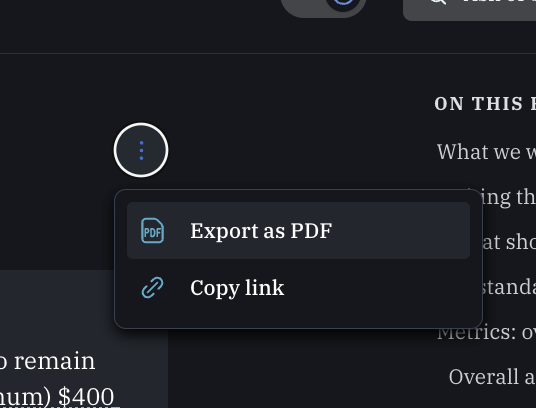

# Why these guidelines/metrics?


_31 Aug 2022:_ Our present approach is a 'working solution', involving some ad-hoc and intuitive choices. We are re-evaluating the metrics we are asking for as well as the interface and framing of this. We are gathering some discussion [in this linked Gdoc](https://docs.google.com/document/d/1QVA0sCvrcKZLKlXuEwJBHKTBKvtn1ml7adTD-2j\_X4g/edit), incorporating feedback from our pilot evaluators and authors, and consulting expertise, past practice, and other ongoing initiatives. We plan to consolidate that discussion and our consensus/conclusions/choices into the present (Gitbook) site. &#x20;


## **Why numerical ratings?**

Ultimately, we're trying to replace ‘what tier of journal did a paper get into?' with 'how highly was the paper rated’? I think this is a more valuable metric, more fine-grained, and less prone to gaming and to the randomness of things like “availability of journal space in a particular field”. See our discussion of ["Reshaping academic evaluation: beyond the binary..."](../../../benefits-and-features/costs-of-playing-the-publication-game.md) .

To get to this point, we need to have academia and stakeholders see our reviews as meaningful. We want them to begin to have some value that is measurable in the way “publication in the AER” is seen to have value. My (David Reinstein's) impression is that previous and ongoing efforts towards journal-independent evaluation tend not to have comparable metrics. Typically, they either had simple ‘tick-boxes’ (like ‘this paper used correct statistical methods: yes/no’) or enabled descriptive evaluation without an overall rating.\
\
As we are not a journal, and we don’t accept/reject, we need another way of assigning value. We are trying to determine the best way of doing this through quantitative ratings. We hope to be able to benchmark to ‘traditional publication outcomes’. Thus, we thought it was important to ask for both an overall quality rating and a journal ‘prediction’.

## Why these categories?

In addition to the overall assessment, we thought it would be valuable to have the papers rated according to several categories. This could be particularly helpful to practitioners who may care about some concerns more than others. It also can be useful to future researchers who might want to focus on reading papers with particular strengths. (Optimistically, it could be useful in meta-analyses, as certain characteristics of papers could be weighed more heavily.) We thought it might also be useful to authors and evaluators themselves in getting a sense of what we think research priorities should be, and thus how to consider an overall rating.

However, these were largely ad-hoc and based on the impressions of our management team, which includes a particular set of mainly economists and psychologists. It’s still being developed. _Any feedback you have is welcome_: _are we overemphasizing certain aspects? Are we excluding some important categories?_

_We are also researching other frameworks, templates, and past practice; we hope to draw from validated, theoretically grounded projects such as_ [_RepliCATS_](https://replicats.research.unimelb.edu.au/resources/)_._

## Why ask for confidence intervals?

In eliciting expert judgment, it is helpful to differentiate the _levelThis_ of confidence in predictions and recommentations. We want to know not only what you believe, but how strongly-held your beliefs are. If you are less certain in one area, we should weigh the information you provide less heavily in updating our beliefs. This may also be particularly useful for practitioners.\
\
Obviously, there are difficulties. People (even experts in a quantitative field) may struggle to convey their own uncertainty. They may also be inherently "poorly calibrated" (see discussions and tools for '[calibration training](https://www.clearerthinking.org/post/2019/10/16/practice-making-accurate-predictions-with-our-new-tool)').  Some people may often be ‘confidently wrong’. They might state very narrow [confidence intervals (or 'credible intervals')](#user-content-fn-1)[^1], when the truth (where measurable) routinely falls outside this. People with greater discrimination may sometimes be _under_confident. One would want to consider and potentially correct for poor calibration (although it is not obvious how to do so if we have no ‘gold standard outcomes’ to judge reviewers as over/underconfident).\
\
As a side benefit, this may be interesting for research [in and of itself](#user-content-fn-2)[^2], particularly as _The Unjournal_ grows. I see 'quantifying one's own uncertainty' as a good exercise for academics (and everyone) to engage in; to try to be more precise in our stated confidence, and aim to be well-calibrated.

## See also

[#more-reliable-precise-and-useful-metrics](../../../benefits-and-features/more-reliable-and-useful-evaluation/#more-reliable-precise-and-useful-metrics "mention") ... explaining the value of the metrics we are seeking from evaluators

[Unjournal Evaluator Guidelines and Metrics - Discussion space](https://docs.google.com/document/d/1QVA0sCvrcKZLKlXuEwJBHKTBKvtn1ml7adTD-2j\_X4g/edit)

Calibration training tools

The [Calibrate Your Judgment app](https://programs.clearerthinking.org/calibrate\_your\_judgment.html) from Clearer Thinking is fairly helpful and fun for practicing and checking how good you are at expressing your uncertainty.  It requires creating account, but that doesn't take long. The 'Confidence Intervals' training seems particularly relevant for our purposes. \
\

[^1]: This distinction embodies the difference between the frequentist and Bayesian approaches to probability and statistics.

[^2]: See especially Phil Tetlock’s work.
