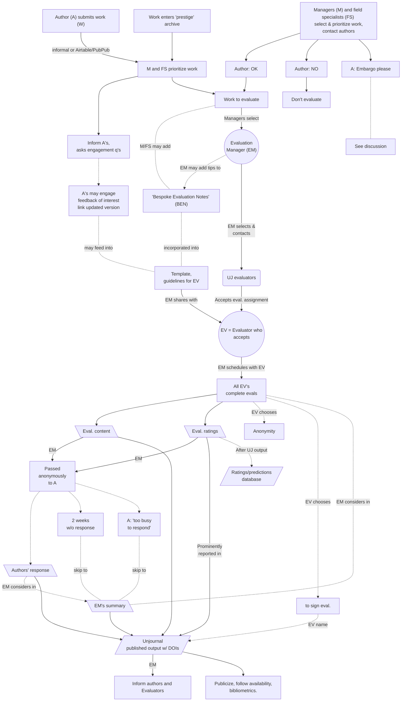

# Mapping evaluation workflow

The flowchart below focuses on the _evaluation_ part of our process.

## Describing key steps in the flowchart

(Section updated 1 August 2023)

1. Submission/selection (multiple routes)
   1. Author (A) submits work (W), creates new submission (submits a URL and DOI), through our platform or informally.
      * Author (or someone on their behalf) can complete a _submission form;_ this includes a potential "request for embargo" or other special treatment.
   2. Managers and field specialists select work (or the project is submitted independently of authors) and the management team agrees to prioritize it.
      * For either of these cases (1 or 2), authors are asked for _permission._
   3. Alternate [_Direct Evaluation track_](considering-projects/direct-evaluation-track.md)_:_ "Work enters prestige archive" (NBER, CEPR, and some other cases).
      * Managers inform and consult the authors but permission [is not needed](#user-content-fn-1)[^1]. (Particularly relevant: we confirm with author that we have the latest updated version of the research.)
2. Prioritization
   * _Following author submission_ ...
     * Manager(s) (M) and Field Specialists (FS) prioritize work for review (see [Project selection and evaluation](considering-projects/)).
   * _Following direct evaluation selection_...&#x20;
     * [M or FS may add additional (fn1) ](#user-content-fn-2)[^2]"evaluation suggestions" (see [examples here](https://docs.google.com/document/d/14HXHQTqwJ5VOw-SBoJD8Sd3jathdO9geKdmhdOOx\_Gw/edit)) explaining why it's relevant, what to evaluate, etc., to be shared later with evaluators.&#x20;
   * If requested (in either case), M decides whether to grant embargo or other special treatment, notes this, and informs authors.
3. [M assigns](#user-content-fn-3)[^3] an Evaluation Manager (EM – typically part of our [management team or advisory board](../readme-1/discussion-team/)) to selected project.
4. EM invites evaluators (aka "reviewers") and shares the paper to be evaluated along with (optionally) a brief summary of why _The_ _Unjournal_ thinks it's relevant, and what we are asking.
   * Potential evaluators are given full access to (almost) all information submitted by the author and M, and notified of any embargo or special treatment granted.
   * EM may make special requests to the evaluator as part of a management policy (e.g., "signed/unsigned evaluation only," short deadlines, extra incentives as part of an agreed policy, etc.).
   * EM (also[^4], optionally) may add "evaluation suggestions" to share with the evaluators.&#x20;
5. Evaluator accepts or declines the invitation to review, and if the former, agrees on a deadline (or asks for an extension).
   * If the evaluator accepts, the EM shares full guidelines/evaluation template and specific suggestions with the evaluator.
6. Evaluator completes [an evaluation form](#user-content-fn-5)[^5].
7. Evaluator submits evaluation including numeric ratings and predictions, plus "CI's" for these.
   * _Possible addition (future plan)_: Reviewer asks for minor revisions and corrections; see "_How revisions might be folded in..._" in the fold below.
8. EM collates all evaluations/reviews, shares these with Author(s).
   * Evaluator must be very careful not to share evaluators' identities at this point.
     * This includes caution to avoid accidentally-identifying information, especially where [evaluators chose anonymity](#user-content-fn-6)[^6].&#x20;
     * Even if evaluators chose to "sign their evaluation," their identity should not be disclosed to authors at this point. However, evaluators are told they can reach out to the [authors if they desire.](#user-content-fn-7)[^7]
   * Evaluations are shared with the authors as a separate doc, set of docs, file, or space; which the [evaluators _do not have automatic access to_](#user-content-fn-8)[^8]_. (Going forward, this will be automated.)_&#x20;
   * It is made clear to authors that their responses will be published (and given a DOI, when possible).
9. Author(s) read(s) evaluations, given two working weeks to submit responses.
   * _If there is an embargo, there is more time to do this, of course._
10. EM creates evaluation summary and "EM comments."
11. EM or _UJ_ team publishes each element on our [PubPub](https://unjournal.pubpub.org/) space as a separate "pub" with a DOI for each (unless embargoed):
    1. Summary and EM comments
       * With a prominent section for the "ratings data tables"
    2. Each evaluation, with summarized ratings at the top
    3. The author response
       * All of the above are linked in a particular way, with particular settings; [see notes](https://docs.google.com/document/d/18Yr95JbeCrDOrn4GpYWamxj2ZcOp9Ex\_arfz-7jZnko/edit)
12. Authors and evaluators are informed once elements are on PubPub; next steps include promotion, checking bibliometrics, etc.
13. ("Ratings and predictions data" to enter an additional public database.)

_Note that we intend to automate and integrate many of the process into an editorial-management-like system in PubPub._

## Consideration for the future: enabling "minor revisions"

In our current (8 Feb 2023 pilot) phase, we have the evaluators consider the paper "as is," frozen at a certain date, with no room for revisions. The authors can, of course, revise the paper on their own and even pursue an updated _Unjournal_ review; we would like to include links to the "permanently updated version" in the _Unjournal_ evaluation space.

_After the pilot, we may consider making minor revisions part of the evaluation process._ This may add substantial value to the papers and process, especially where evaluators identify straightforward and easily-implementable _improvements._

How revisions might be folded into the above flow

_If "minor revisions" are requested_:

* ... the author has four (4) weeks (strict) to make revisions if they want to, submit a new linked manuscript, and also submit their response to the evaluation.
* _Optional_: Reviewers can comment on any minor revisions _and adjust their rating._

### **Why would we (potentially) consider only minor revisions?**

We don't want to replicate the slow and inefficient processes of the traditional system. Essentially, we want evaluators to give a report and rating _as the paper stands._

We also want to encourage papers as [permanent-beta ](../benefits-and-features/dynamic-documents-vs-living-projects/living-research-projects.md)projects. The authors can improve it, if they like, and resubmit it for a new evaluation.

[^1]: Not at NBER and mainly not at CEPR, but see discussion.&#x20;

[^2]: This might occur through the same "submission form" that authors complete.

[^3]: Here, this should be someone on the management team. A field specialist does not need to be the evaluation manager for the paper they recommend, but if not, they should  ask someone on The Unjournal Management Team to help find an evaluation manager.&#x20;

[^4]: Perhaps in addition to any added by the Manager.

[^5]: At present this is an out-link to a Googe Doc; we aim to embed this in an editorial-management-like system in PubPub.

[^6]: Where evaluators chose anonymity, none of their evaluation content should be linked to their real names or identity by design. Still, this should be double-checked.

[^7]: The evaluators can also ask us to disclose their identity and contact info to the authors at this point, to save them the hassle

[^8]: Make this clear to authors. Authors can reach out to evaluators and share any of this if they wish, but they are not required to do so.
