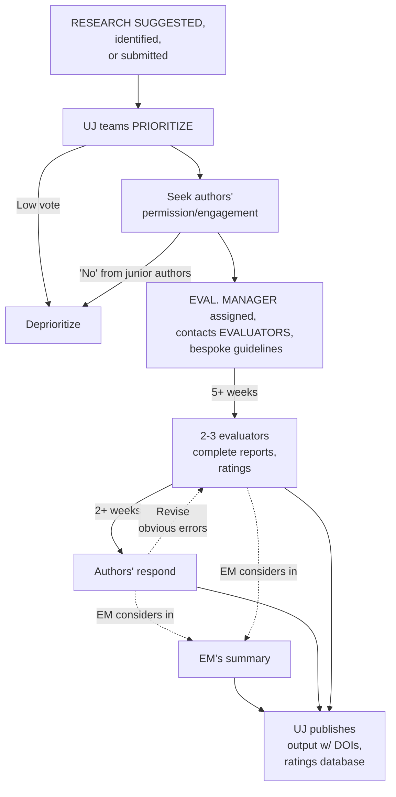

# Evaluation workflow – Simplified

A simplified rendering, skipping some steps and possibilities

```mermaid
graph TD
  S["RESEARCH SUGGESTED, <br/> identified, <br/> or submitted"] 
  S --> MP["UJ teams PRIORITIZE"]
  MP --> |Low vote| DP[Deprioritize]
  MP --> AA["Seek authors' <br/> permission/engagement"] 
  AA --> |"'No' from junior authors"| DP 
  AA -->  EM["EVAL. MANAGER assigned, <br/> contacts EVALUATORS, <br/> bespoke guidelines"]
  EM --> |5+ weeks| EVC["2-3 evaluators <br/> complete reports, <br/> ratings"] 
  EVC --> |2+ weeks| ARE["Authors' respond"] -.-> |Revise <br/> obvious errors| EVC
  ARE -.->|EM considers in| EMS["EM's summary"]
  EVC -.->|EM considers in| EMS
  EMS --> UJO["UJ publishes <br/> output w/ DOIs, <br/> ratings database"]
  ARE --> UJO
  EVC --> UJO
  
  

```
